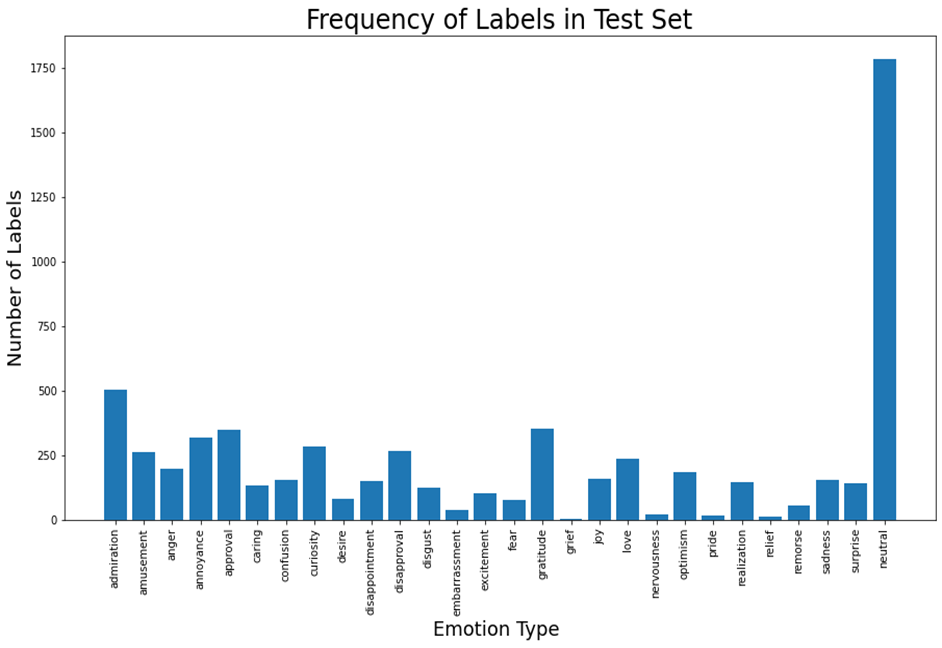
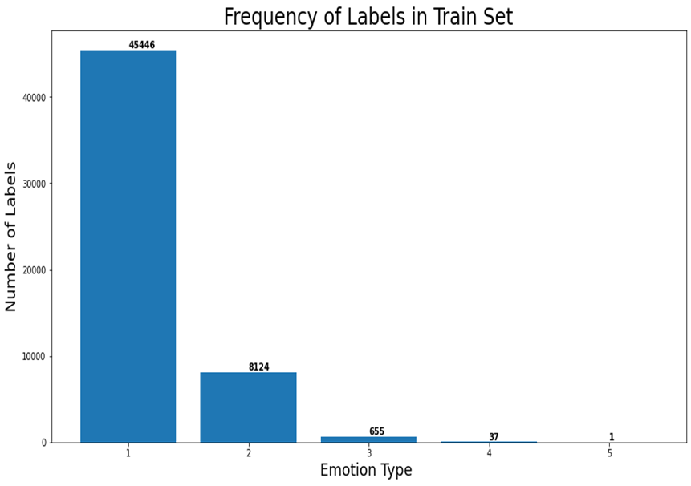
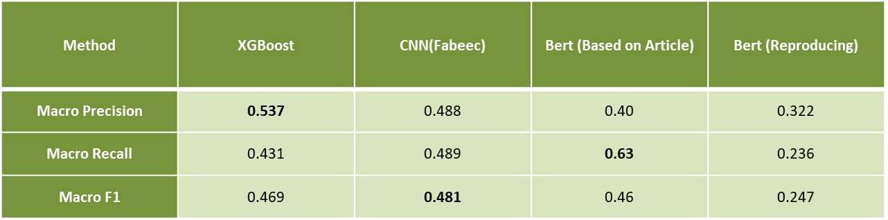

# fabeec
FAstText-Bert Embedding Emotion Classification

Emotion is an inseparable part of human experiences and social interactions.  Emotions reveal people’s feelings and thoughts.
On the other hand, writing is a way of communication and expressing feelings. With  the  development  of  technology  and  rapid  popularization  of  Internet,  people  can  express  their opinions and emotions in digital writing forms. 
Thus, there has been an explosive growth in digital text information, such as social media post, news articles, customer review.  This data not only conveys positive or negative feelings but also shows detailed emotions such as happiness, fear or grief. Since,there  have  been  considerable  advances  in  Artificial  Intelligence  and  machine  learning  methods  that enable
machines  to  understand  human  behaviours,  emotion  classification  techniques  have  attracted wide attention in machine learning and natural language processing field [1] [2]. 
The outcome of these research can be employed in variety of applications such as Public health[3], Detecting harmful online behavior [4], Marketing [5], Human-computer interactions [6], Political science [7].

# Dataset
In this project we used GoEmotions data set which has been published by google research team in 2020 and is the largest manually annotated dataset published for emotion classification problem. This data set has more than 58000 samples labeled in 27 classes plus "neutral". GoEmotions is a multi-label data set which mean it has more than one class label for some of its samples. 

 Fig. 1- Distribution of samples among different classes

 Fig. 2- Frequency of n-labels samples in the data set, 1<=n<=5

# Codes
We mainly developed our method in the Google Co-Lab notebook which you can find access to it by the following link:
[SubZero: Fabeec Emotion Classification](https://colab.research.google.com/drive/1A5dWjf98VP5PA1Iyj16KT2swAkdpESCH?authuser=3#scrollTo=ZubarRGc6n5b)

Although we implemented main parts of the code in the Colab notebook, we had insufficient memory for training our models including FastText and Bert. 
Thus we had to create different version of code and run it on another server locally, so we will introduce the other python file as below:
1. fasttext_tfidf.py : this file train a Fasttext model from scratch, create TF-IDF vector for each document existing in the data set. Then having calculated the TF-IDF and FastText, it combine these information, at token level, using a weighted average schema to build the sentences embedding vectors. 
   Finally, we train classifiers and evaluate the results. in order to run this file use the followin command:
   
> python -m fasttext_tfidf

2. fabeec_tfidf.py : weighted average embedding vectors for each documents is built using as described in the fasttext_tfidf code, then we fintune a Bert model to capture catextual embeddings and concat these two vectors to build a more mature feature vector for training the models. As a result of this process we 
get 1068 dimensions vector, 768 features for the BERT and 300 features from the Fasttext-TF-IDF schema. To run the file and train the classifiers do the folowing:
> python -m fabeec_tfidf.py 

# Results
So far our method, FastText+TF-IDF combine with BERT which we call it fabeec has outperformed the original finetuned bert method reported in the GoEmotion papers.
 Fig. 3- Final results comparing fastText to the fine-tuned GoEmotion model

# Future works

1. As the dataset is imbalanced we believe applying some over/under sampling methods like SMOOTE increase the performance of the models. We saw this results when we applied a balanced version of Random Forest method which the results get boosted and the same approach will increase the performance of the our berst models which is CNN and XGBoost so far. 
2. Also we would like to apply another weighting schema rather than TF-IDF where the emotional keywords for each class find a higher impact which help us obtain better results.
3. Finally we need to apply a hyper-parameter tuning phase to get sure we used the model in the best way to train our model. 

# References

1. Erik Cambria et al. “Affective computing and sentiment analysis". In: A practical guide to sentiment analysis. Springer, 2017, pp. 1-10.
2. Lin Gui et al. “Learning representations from heterogeneous network for sentiment classification of product reviews". In: Knowledge-Based Systems 124 (2017), pp. 34-45.
3. Gobinda G Chowdhury. “Natural language processing". In: Annual review of information science and technology 37.1 (2003), pp. 51-89.
4. Francisca Adoma Acheampong, Chen Wenyu, and Henry Nunoo-Mensah. “Text-based emotion detection: Advances, challenges, and opportunities". In: Engineering Reports 2.7 (2020), e12189.
5. Dorottya Demszky et al. “Goemotions: A dataset of fine-grained emotions". In: arXiv preprint arXiv:2005.00547 (2020).
6. Hassan Alhuzali and Sophia Ananiadou. “SpanEmo: Casting Multi-label Emotion Classification
as Span-prediction". In: arXiv preprint arXiv:2101.10038 (2021).
7.  Erdenebileg Batbaatar, Meijing Li, and Keun Ho Ryu. “Semantic-emotion neural network for
emotion recognition from text". In: IEEE Access 7 (2019), pp. 111866-111878.
8. Xingliang Mao et al. “Sentiment-aware word embedding for emotion classification". In: Applied
Sciences 9.7 (2019), p. 1334.
9. Ashwin Geet d’Sa, Irina Illina, and Dominique Fohr. “Bert and fasttext embeddings for automatic detection of toxic speech". In: 2020 International Multi-Conference on:”Organization of Knowledge and Advanced Technologies"(OCTA). IEEE. 2020, pp. 1-5.